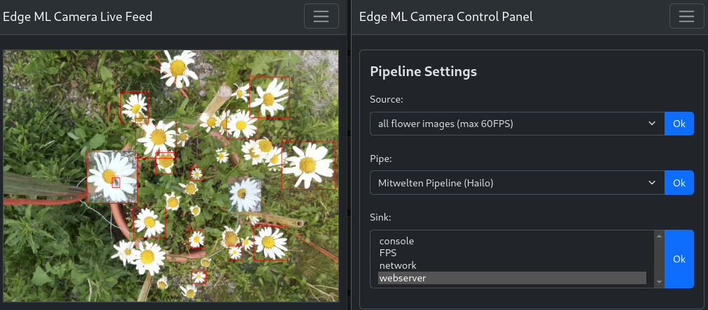

<div align="center">
 <h2>Edge ML Camera</h2>
</div>
</br>

## About the Project

Edge ML Camera is a modular and extensible application designed for processing video streams using machine learning. The application allows integration of various video sources, application of processing pipelines, and output of results to different sinks.




## Table of Contents

- [Installation](#installation)
- [Configuration](#configuration)
- [Directory Structure](#directory-structure)
- [Extensibility](#extensibility)
- [Configuration Example](#configuration-example)
- [Running the Application](#running-the-application)
- [Web-Based Configuration Interface](#web-based-configuration-interface)

## Installation

The installation depends on your system configuration.

### Hardware Specific Installation
Follow the instructions for the different Hardware:

Rasperry Pi Camera: 

Raspberry Pi AI-Camera: [Raspberry Pi Documentation](https://www.raspberrypi.com/documentation/accessories/ai-camera.html#getting-started)

M.2 HAT+: [M.2 HAT+ Documentation](https://www.raspberrypi.com/documentation/accessories/m2-hat-plus.html#m2-hat-plus-installation)

AI-Kit: [AI Kit Documentation](https://www.raspberrypi.com/documentation/accessories/ai-kit.html#ai-module-features)

AI HAT+: [AI Kit Documentation](https://www.raspberrypi.com/documentation/accessories/ai-hat-plus.html#ai-hat-plus-installation)

> For AI-Kit and AI HAT+, also make sure to follow these instructions: [AI Kit and AI HAT+ Software](https://www.raspberrypi.com/documentation/computers/ai.html)

### Software Installation

1. **Clone the Repository**:

```bash
git clone https://github.com/andriwild/ip7-edge-ml-cam.git
cd ip7-edge-ml-cam
```

2. **Create and Activate a Virtual Environment**:

```bash
python3 -m venv .venv
source .venv/bin/activate
```
3. Install Dependencies:

```bash
pip install -r requirements.txt
```

### Systemd Service

To run the application automatically on start up, create a systemd service:

```bash
sudo nano /etc/systemd/system/edge-ml-camera.service
```

Configure the Service:
> Replace <USER> and <APP_NAME> with your corresponding folder names!
```bash
$ cat /etc/systemd/system/<APP_NAME>.service
[Unit]
Description=Edge ML Service
After=network.target

[Service]
Type=simple
ExecStart=/home/<USER>/<APP_NAME>/.venv/bin/python /home/<USER>/<APP_NAME>/app.py -c pi_config.yml
WorkingDirectory=/home/<USER>/<APP_NAME>

Restart=always
RestartSec=5

[Install]
WantedBy=multi-user.target
```
After configuration the service, reoload the daemon:

```bash
sudo systemctl daemon-reload
```
For auto start up, execute:

```bash
sudo systemctl enable edge-ml-camera
```

Launch the application:

```bash
sudo systemctl start edge-ml-camera
```
Stop the application:

```bash
sudo systemctl stop edge-ml-camera
```


## Configuration

The application is controlled via a YAML configuration file. An example of such a file can be found in the Configuration Example section. Adjust the configuration according to your hardware and requirements.


### Directory Structure

The application is modular and follows a clear directory structure:

```bash
$ tree -L 2 -d -I __pycache__
.
├── model
├── operation
│   ├── base
│   └── impl
├── pipeline
├── resources
│   ├── doc
│   ├── images
│   ├── labels
│   └── ml_models
├── sink
│   ├── base
│   └── impl
├── source
│   ├── base
│   └── impl
├── static
│   ├── assets
│   └── templates
└── utilities
```
- **source**: Contains the base class for sources and implementations for various video sources.
- **operation**: Contains the base class for processing operation and specific implementations.
- **sink**: Contains the base class for sinks and various output implementations.
- **resources**: Contains models, images, and other resources.
- **static**: Contains files for the servers (html, css, js).


### Configuration Example

Below is an example of a configuration file (config.yml):
```yaml
sources:
  - name: webcam
    file_path: ./source/impl/webcam.py
    class_name: Webcam
    parameters:
      device: "/dev/video0"
      width: 640
      height: 640

operations:
  - name: Mitwelten Pipeline (NCNN)
    class_name: Mitwelten
    file_path: ./operation/impl/mitwelten_ncnn.py
    parameters:
      flower_params:
        confidence_threshold: 0.6
        label_path: ./resources/labels/flower.txt
        param_file: ./resources/ml_models/flower_n_sim.ncnn.param
        bin_file: ./resources/ml_models/flower_n_sim.ncnn.bin
        use_gpu: False
        num_threads: 4
      pollinator_params:
        model_path: ./resources/ml_models/yolov8n_pollinator_ep50_v1_ncnn_model
        label_path: ./resources/labels/pollinator.txt
        confidence_threshold: 0.2

sinks:
  - name: console
    class_name: Console
    file_path: ./sink/impl/console.py
```
In this configuration, parameters are passed to the respective classes. Adjust the parameters according to the specific requirements of each implementation.


## Running the Application

Ensure that the configuration file is set up correctly, then start the application with the following command:

```bash
python3 app.py -config config.yml
```

To debug the application, launch with verbose Flag
```bash
python3 app.py -config config.yml -v
```

If you have trouble, consider the application logs:
```bash
$ journalctl -u edge-ml-camera.service -f -b 1 # following since last boot
$ journalctl -u edge-ml-camera.service --since "1 hour ago" # last one hour
```

## Web-Based Configuration Interface

The application offers a web-based configuration interface, which runs by default on port `8001`. You can access it by navigating to `http://localhost:8001` in your browser. Ensure that the port is open in your firewall and that no other services are using this port.

## Extensibility
The application is designed for easy extensibility. To add a new source, pipeline, or sink, create a new implementation that inherits from the appropriate base class and place it in the respective impl subdirectory. Ensure that the new implementation is referenced in the configuration file.
For guidance, consider the implementaion of the corresponding folder.

## Contributing

Contributions are what make the open source community such an amazing place to learn, inspire, and create. Any contributions you make are **greatly appreciated**.

If you have a suggestion that would make this better, please fork the repo and create a pull request. You can also simply open an issue with the tag "enhancement".
Don't forget to give the project a star! Thanks again!

1. Fork the Project
2. Create your Feature Branch (`git checkout -b feature/AmazingFeature`)
3. Commit your Changes (`git commit -m 'Add some AmazingFeature'`)
4. Push to the Branch (`git push origin feature/AmazingFeature`)
5. Open a Pull Request

### Top contributors:

<a href="https://github.com/andriwild/ip7-edge-ml-cam/graphs/contributors">
  
</a>

## License

Distributed under the AGPL-3.0 License. See LICENSE.txt for more information.

## Contact
- Andri Wild - andri.wild@students.fhnw.ch