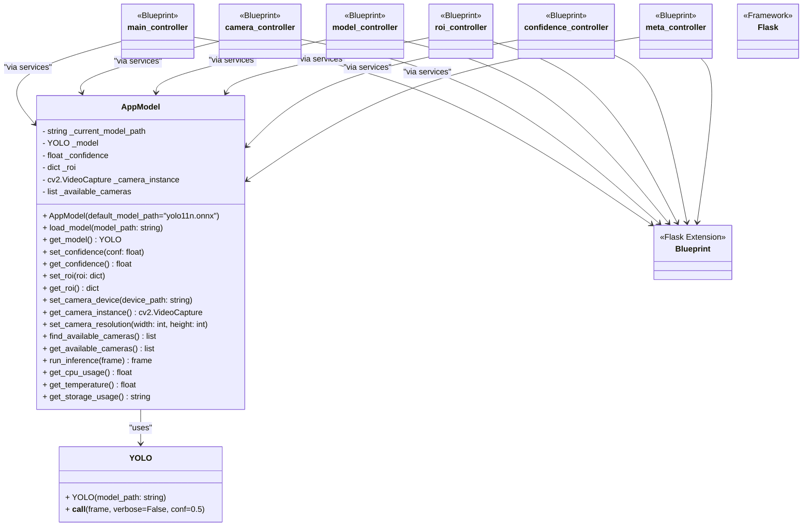

```mermaid
classDiagram

    class AppModel {
        - string _current_model_path
        - YOLO _model
        - float _confidence
        - dict _roi
        - cv2.VideoCapture _camera_instance
        - list _available_cameras

        + AppModel(default_model_path="yolo11n.onnx")
        + load_model(model_path: string)
        + get_model() YOLO
        + set_confidence(conf: float)
        + get_confidence() float
        + set_roi(roi: dict)
        + get_roi() dict
        + set_camera_device(device_path: string)
        + get_camera_instance() cv2.VideoCapture
        + set_camera_resolution(width: int, height: int)
        + find_available_cameras() list
        + get_available_cameras() list
        + run_inference(frame) frame
        + get_cpu_usage() float
        + get_temperature() float
        + get_storage_usage() string
    }

    class YOLO {
        + YOLO(model_path: string)
        + __call__(frame, verbose=False, conf=0.5)
    }

    class main_controller {
        <<Blueprint>>
    }

    class camera_controller {
        <<Blueprint>>
    }

    class model_controller {
        <<Blueprint>>
    }

    class roi_controller {
        <<Blueprint>>
    }

    class confidence_controller {
        <<Blueprint>>
    }

    class meta_controller {
        <<Blueprint>>
    }

    class Flask {
        <<Framework>>
    }

    class Blueprint {
        <<Flask Extension>>
    }

    %% Relationships
    AppModel --> YOLO : "uses"
    main_controller --> AppModel : "via services"
    camera_controller --> AppModel : "via services"
    model_controller --> AppModel : "via services"
    roi_controller --> AppModel : "via services"
    confidence_controller --> AppModel : "via services"
    meta_controller --> AppModel : "via services"
    main_controller --> Blueprint
    camera_controller --> Blueprint
    model_controller --> Blueprint
    roi_controller --> Blueprint
    confidence_controller --> Blueprint
    meta_controller --> Blueprint

```
